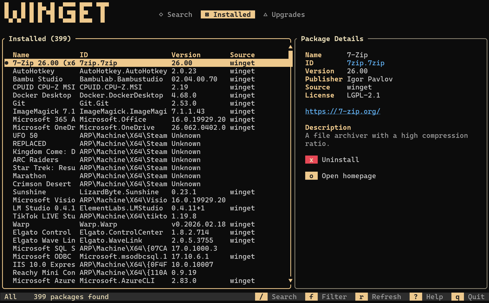

# winget-tui

A terminal user interface for [Windows Package Manager (winget)](https://github.com/microsoft/winget-cli). Search, install, uninstall, and upgrade Windows packages without leaving your terminal.




## Features

- **Search & Discover** — Find packages across all winget sources
- **Installed Packages** — View everything installed on your system
- **Upgrade Management** — See available updates at a glance
- **Source Filtering** — Filter by source (winget, msstore, or all)
- **Package Details** — View publisher, description, license, homepage
- **Keyboard-Driven** — Vim-style navigation, no mouse needed
- **Non-Blocking** — Install/uninstall/upgrade run in the background
- **Single Binary** — No runtime dependencies beyond winget itself

## Prerequisites

- Windows 10/11
- [winget](https://github.com/microsoft/winget-cli) 1.4+ installed
- A terminal with Unicode support (Windows Terminal recommended)

## Installation

### Via Winget (Coming Soon)

Once available in the Windows Package Manager:

```powershell
winget install Shanselman.WingetTUI
```

See [WINGET_SUBMISSION.md](WINGET_SUBMISSION.md) for details on submitting to winget.

### From Releases

Download the latest release for your platform from the [Releases page](https://github.com/shanselman/winget-tui/releases):

- **winget-tui-x64.exe** - Windows x64
- **winget-tui-arm64.exe** - Windows ARM64

No installation required - just download and run.

### From source

```sh
git clone https://github.com/shanselman/winget-tui.git
cd winget-tui
cargo build --release
```

The binary will be at `target\release\winget-tui.exe`.

## Usage

```sh
winget-tui
```

### Keybindings

| Key | Action |
|-----|--------|
| `↑` / `k` | Move up |
| `↓` / `j` | Move down |
| `PgUp` / `PgDn` | Jump 20 items |
| `Home` / `End` | Jump to first / last |
| `Tab` | Cycle views (Search → Installed → Upgrades) |
| `/` or `s` | Focus search input |
| `Enter` | Submit search / show details |
| `f` | Cycle source filter (All → winget → msstore) |
| `r` | Refresh current view |
| `i` | Install selected package |
| `u` | Upgrade selected package |
| `x` | Uninstall selected package |
| `?` | Toggle help overlay |
| `q` / `Esc` | Quit / close dialog |
| `Ctrl+C` | Quit |

### Mouse Support

- **Click** on tabs to switch views (Search / Installed / Upgrades)
- **Click** on the filter bar to cycle source filters
- **Click** on the search bar to start typing a search
- **Click** on a package row to select it and load details
- **Scroll wheel** over the package list to navigate up/down
- **Right-click** a package to select and load its details
- **Click & drag** the scrollbar to scrub through the list

### Views

- **Installed** (default) — Lists all packages installed on your system
- **Search** — Search the winget repository for new packages
- **Upgrades** — Shows packages with available updates

## Architecture

```
winget-tui
├── src/
│   ├── main.rs          # Entry point, terminal setup/teardown
│   ├── app.rs           # App state, message passing, async coordination
│   ├── backend.rs       # WingetBackend trait (abstraction layer)
│   ├── cli_backend.rs   # CLI implementation (shells out to winget.exe)
│   ├── handler.rs       # Keyboard and mouse input handling
│   ├── models.rs        # Data types (Package, Source, Operation, etc.)
│   └── ui.rs            # Ratatui rendering (all UI components)
└── Cargo.toml
```

The backend is behind a trait (`WingetBackend`) to allow future implementations (e.g., COM API for better performance).

## License

MIT
