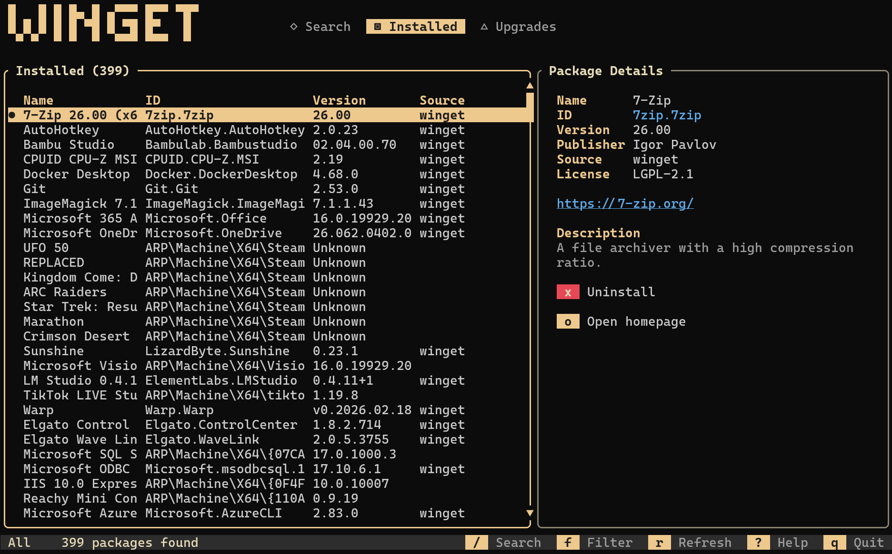

# winget-tui

**New design and visual research by [@niels9001](https://github.com/niels9001).**

A terminal user interface for [Windows Package Manager (winget)](https://github.com/microsoft/winget-cli). Search, install, uninstall, and upgrade Windows packages without leaving your terminal.




## Features

- **Search & Discover** — Find packages across all winget sources
- **Installed Packages** — View everything installed on your system
- **Upgrade Management** — See updates at a glance and batch-upgrade multiple packages
- **Pin Awareness** — Pin or unpin installed packages and filter pinned items without leaving the TUI
- **Source Filtering** — Filter by source (winget, msstore, or all)
- **Real-Time Local Filter** — Narrow Installed and Upgrades lists instantly with `/` or `s`
- **Sortable Columns** — Sort by Name, ID, or Version (ascending or descending) with `S`
- **Version-Specific Install** — Install a specific version with `I`
- **CSV Export** — Save the current visible package list to a CSV file with `e`
- **Package Details** — View publisher, description, license, homepage, and release notes
- **Graceful Local Package Info** — Non-winget installs still show a useful explanation when rich manifest metadata is unavailable
- **Scrollable Details Pane** — Read long descriptions without losing your place in the package list
- **Configurable Startup Defaults** — Set your default view and source in `config.toml`
- **Keyboard-Driven** — Vim-style navigation, no mouse needed
- **Non-Blocking** — Install/uninstall/upgrade run in the background
- **Single Binary** — No runtime dependencies beyond winget itself

## Prerequisites

- Windows 10/11
- [winget](https://github.com/microsoft/winget-cli) 1.4+ installed
- A terminal with Unicode support (Windows Terminal recommended)

## Installation

### Install with Winget

`winget-tui` has been submitted to the Windows Package Manager community
repository as `Hanselman.WingetTUI`. Once the submission is merged, install it
with:

```powershell
winget install Hanselman.WingetTUI
```

### Download a release (recommended)

You do **not** need Rust to install or run `winget-tui`.

1. Download the latest Windows binary from the [Releases page](https://github.com/shanselman/winget-tui/releases/latest):
   - `winget-tui-x64.exe` for most Windows PCs
   - `winget-tui-arm64.exe` for Windows on ARM
2. Put the `.exe` somewhere convenient, such as `C:\Tools\winget-tui\`.
3. Run it from Windows Terminal:

```powershell
.\winget-tui-x64.exe
```

Optionally rename the file to `winget-tui.exe` and add its folder to your `PATH` so you can run `winget-tui` from any terminal.

### Run from source for development

Building from source is only needed if you want to develop or test changes locally. It requires:

- The Rust toolchain (`cargo`, `rustc`)
- Visual Studio Build Tools with the C++ workload (`link.exe`) and a Windows SDK (`msvcrt.lib`)

If `cargo` is not already available, install Rust first:

```powershell
winget install --id Rustlang.Rustup -e
```

If `cargo run` fails with `linker 'link.exe' not found` or `cannot open file 'msvcrt.lib'`, install the C++ build tools:

```powershell
winget install --id Microsoft.VisualStudio.2022.BuildTools -e
```

In the Visual Studio Build Tools installer, select **Desktop development with C++** and make sure a **Windows 10/11 SDK** is selected in the optional components. Close and reopen your terminal, then run the app from the repo:

```powershell
git clone https://github.com/shanselman/winget-tui.git
cd winget-tui
cargo run
```

For an optimized local build:

```powershell
cargo build --release
.\target\release\winget-tui.exe
```

The binary will be at `target\release\winget-tui.exe`.

## Usage

```sh
winget-tui
```

### Keybindings

| Key | Action |
|-----|--------|
| `↑` / `k` | Move up |
| `↓` / `j` | Move down |
| `PgUp` / `PgDn` | Jump one page |
| `Home` / `End` | Jump to first / last |
| `←` / `→` | Cycle views backward / forward |
| `Tab` / `Shift+Tab` | Toggle focus between the package list and detail panel |
| `/` or `s` | Focus search in Search view, or local filter in Installed/Upgrades |
| `Enter` | Submit search / show details |
| `f` | Cycle source filter (All → winget → msstore) |
| `r` | Refresh current view |
| `e` | Export the current visible package list to CSV |
| `i` | Install selected package |
| `I` | Install a specific version of the selected package |
| `u` | Upgrade selected package |
| `x` | Uninstall selected package |
| `p` | Pin / unpin the selected installed package (blocks upgrades) |
| `P` | Cycle pin filter (All → Pinned only → Hide pinned) |
| `Space` | Toggle selection for batch upgrade (Upgrades view) |
| `a` | Select / deselect all packages (Upgrades view) |
| `U` | Upgrade all selected packages (Upgrades view) |
| `o` | Open package homepage in your browser |
| `c` | Open release notes / changelog in your browser |
| `S` | Cycle sort (Name↑ → Name↓ → ID↑ → ID↓ → Version↑ → Version↓ → off) |
| `?` | Toggle help overlay |
| `q` / `Esc` | Quit / close dialog |
| `Ctrl+C` | Quit |

### Mouse Support

- **Click** on tabs to switch views (Search / Installed / Upgrades)
- **Click** on the filter bar to cycle source filters
- **Click** on the search bar to start typing a search
- **Click** on a package row to select it and load details
- **Scroll wheel** over the package list to navigate up/down
- **Scroll wheel** over the detail pane to scroll long package details
- **Right-click** a package to select and load its details
- **Click & drag** the scrollbar to scrub through the list

### Views

- **Installed** (default) — Lists all packages installed on your system
- **Search** — Search the winget repository for new packages
- **Upgrades** — Shows packages with available updates

## Configuration

You can customize the startup view, source filter, sort order, and pinned-package
filter with an optional config file:

- Windows: `%APPDATA%\winget-tui\config.toml`
- Dev/non-Windows fallback: `$HOME/.config/winget-tui/config.toml`

Example:

```toml
default_view = "upgrades"          # installed | search | upgrades
default_source = "winget"          # all | winget | msstore
default_sort = "name"              # name | name_desc | id | id_desc | version | version_desc | none
default_pin_filter = "hide_pinned" # all | pinned | hide_pinned
```

## Architecture

```
winget-tui
├── src/
│   ├── main.rs          # Entry point, terminal setup/teardown
│   ├── app.rs           # App state, message passing, async coordination
│   ├── backend.rs       # WingetBackend trait (abstraction layer)
│   ├── cli_backend.rs   # CLI implementation (shells out to winget.exe)
│   ├── config.rs        # Config file parsing and startup defaults
│   ├── handler.rs       # Keyboard and mouse input handling
│   ├── models.rs        # Data types (Package, Source, Operation, etc.)
│   ├── theme.rs         # Semantic theme colors and shared styles
│   └── ui.rs            # Ratatui rendering (all UI components)
└── Cargo.toml
```

The backend is behind a trait (`WingetBackend`) to allow future implementations (e.g., COM API for better performance).

## License

MIT
